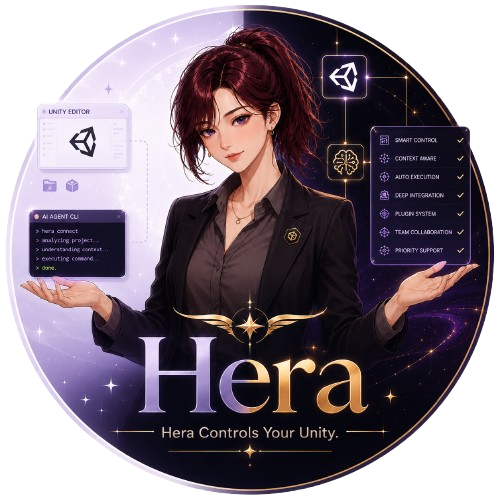
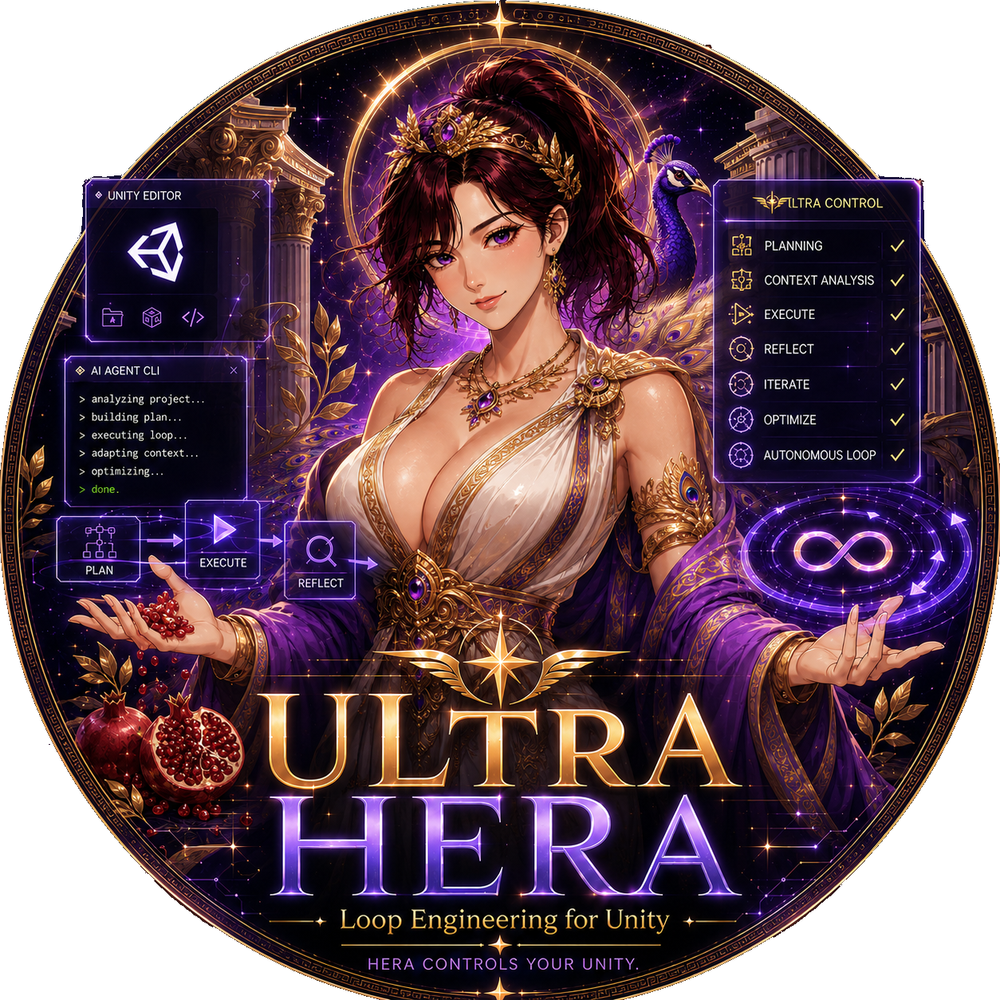

<div align="center">



<br>

[](https://github.com/NotNull92/hera-agent-unity/releases)
[](LICENSE)
[](https://go.dev)
[](https://unity.com)
[]()

**Low-token Unity Editor control for AI coding agents.**

<sub>Let Codex, Claude, Cursor, Copilot, and AntiGravity inspect and change your live Unity project — no MCP setup, no Python server.</sub>

<br>

[What it is](#what-it-is) · [Why it helps](#why-it-helps) · [Quick Start](#quick-start) · [Install](#install) · [Commands](#commands) · [Token Saving](#token-saving) · [Input QA](#input-qa) · [Game Feel Mode (Beta)](#game-feel-mode-beta) · [Game Feel UI Mode (Beta)](#game-feel-ui-mode-beta) · [Ultra Hera](#ultra-hera) · [Unity Versions](#unity-versions) · [Agent Rules](#add-project-rules-for-agents) · [Projects](#projects-using-hera) · [FAQ](#faq)

**English** · [한국어](README.ko.md)

</div>

---

## What It Is

`hera-agent-unity` is a low-token CLI that lets AI coding agents control a running Unity Editor.

Think of it like a remote control for the live Editor:

| You want the AI to... | Hera lets it... |
|:---|:---|
| See if Unity is open | ask the real Editor |
| Run C# code | run it inside your loaded project |
| Check console errors | read the actual Unity Console |
| Enter Play Mode | press Play and wait |
| Create or edit objects | use Unity APIs safely |
| Build UI | create real Unity UI objects and capture the result |
| Verify UI input | send Unity EventSystem events without relying on screen coordinates |

The AI does not need to guess from stale training data. It can inspect the real Editor, act on it, and check the result.

```text
AI agent  ->  hera-agent-unity  ->  Unity Editor
```

---

## Why It Helps

AI often makes mistakes in Unity because it cannot see your Editor.

It may guess:

- which scene is open;
- which objects exist;
- which Unity API exists in your version;
- whether Play Mode works;
- what error is in the console.

Hera fixes that by letting the AI ask Unity directly.

```bash
hera-agent-unity status
hera-agent-unity console --type error
hera-agent-unity exec "return Application.unityVersion;"
hera-agent-unity editor play --wait
```

No Python server. No generated MCP config. No special agent plugin. If an agent can run a shell command, it can use Hera.

---

## Release Highlights

Latest release: **v0.0.38**. This release adds Hera-driven Unity UI input QA and keeps the existing low-token Unity version support.

| Highlight | Simple meaning |
|:---|:---|
| **Input QA EventSystem backend** | Agents can inspect and drive uGUI through Unity's `EventSystem`, even when external Computer Use cannot safely click coordinates. |
| **Separate physical-click evidence** | `input` proves Unity UI event behavior; it does not pretend to be an OS/window click. Physical-click QA can still be reported as blocked. |
| **Click, submit, scroll, and drag** | `input` supports `state`, `inspect`, `click`, `pointer_down`, `pointer_up`, `submit`, `scroll`, and stepped `drag`. |
| **Connector 0.0.57** | The Unity package includes the new input tool, tests, docs, and agent-rule guidance. |
| **Unity 2022.3 LTS support** | Teams do not need to upgrade to Unity 6 first. |
| **Unity 2023.2 support** | The connector and docs lookup work below Unity 6. |
| **Unity 6000.3 / 6000.5 checked separately** | Unity 6 minor versions can differ, so they are tested separately. |
| **93-token tool list** | `list --compact` is small enough to use often. |
| **49-55-token object handoff** | `find_gameobjects --ids` returns only the IDs an agent needs for the next command. |
| **Signature: Game Feel Mode (Beta)** | Hera can tell the agent how to make gameplay feel right — with the ethics built in. |
| **Signature: Game Feel UI Mode (Beta)** | Hera can tell the agent how to make generated UI feel alive, not static. |
| **Ultra Hera** | Agents can use light checks by default and upgrade to strict Unity verification when the task asks for it. |
| **uGUI docs fixer** | `ui_doc apply` selects the official uGUI rule set for the open Unity Editor version and reports fixes/diagnostics. |

Measured versions:

| Unity Editor | `list --compact` | `find_gameobjects --ids` | Details |
|:---|---:|---:|:---|
| 2022.3.62f2 | **93 T** | **54 T** | [benchmark](docs/benchmarks/token-reduction/2022.3.62f2.md) |
| 2023.2.22f1 | **93 T** | **54 T** | [benchmark](docs/benchmarks/token-reduction/2023.2.22f1.md) |
| 6000.3.5f2 | **93 T** | **49 T** | [benchmark](docs/benchmarks/token-reduction/6000.3.5f2.md) |
| 6000.5.0f1 | **93 T** | **55 T** | [benchmark](docs/benchmarks/token-reduction/6000.5.0f1.md) |

Full benchmark notes: [docs/benchmarks/token-reduction/README.md](docs/benchmarks/token-reduction/README.md)

---

## Quick Start

### 1. Open Unity

Open a Unity project that has the Hera Unity package installed.

### 2. Check the connection

```bash
hera-agent-unity status
```

You should see the project name, Unity version, port, and state.

### 3. Ask your AI agent to use it

Example prompt:

```text
Use hera-agent-unity. Check the Unity console, enter Play Mode, reproduce the issue, and fix it.
```

The agent can then run commands like:

```bash
hera-agent-unity console --type error
hera-agent-unity editor play --wait
hera-agent-unity exec "return EditorSceneManager.GetActiveScene().name;"
hera-agent-unity test --mode PlayMode
```

---

## Install

There are two parts:

1. the CLI program on your computer;
2. the Unity package inside your project.

### CLI

**Windows PowerShell**

```powershell
powershell -ExecutionPolicy ByPass -c "irm https://raw.githubusercontent.com/NotNull92/hera-agent-unity/main/install.ps1 | iex"
```

Open a new terminal after install, then check:

```powershell
hera-agent-unity version
```

**macOS / Linux**

```bash
curl -fsSL https://raw.githubusercontent.com/NotNull92/hera-agent-unity/main/install.sh | bash
```

**Go install**

```bash
go install github.com/NotNull92/hera-agent-unity@latest
```

**Manual**

Download a binary from [Releases](https://github.com/NotNull92/hera-agent-unity/releases), then run:

```bash
hera-agent-unity install
```

### Unity Package

In Unity:

```text
Window -> Package Manager -> Add package from git URL
```

Use this URL:

```text
https://github.com/NotNull92/hera-agent-unity.git?path=AgentConnector
```

Or add this to `Packages/manifest.json`:

```json
"com.notnull92.hera-agent-unity": "https://github.com/NotNull92/hera-agent-unity.git?path=AgentConnector"
```

The connector starts by itself when Unity opens.

---

## Commands

Here are the commands most agents use first.

| Command | What it does |
|:---|:---|
| `status` | Shows which Unity Editor is connected. |
| `doctor --json` | Checks install, PATH, and Unity connection. |
| `list --compact` | Lists tools with a small response. |
| `console --type error` | Reads real Unity errors. |
| `exec "..."` | Runs C# inside Unity. |
| `editor play --wait` | Enters Play Mode and waits. |
| `editor stop` | Stops Play Mode. |
| `scene info` | Shows the active scene. |
| `find_gameobjects` | Finds objects in the loaded scenes. |
| `manage_assets` | Finds, creates, copies, moves, or deletes project assets under `Assets/`. |
| `manage_gameobject` | Creates, duplicates, moves, renames, parents, or deletes GameObjects. |
| `manage_components` | Adds, removes, reads, or edits components. |
| `ui_doc` | Builds and captures Unity UI. |
| `input` | Verifies uGUI interaction through Unity EventSystem raycasts and pointer handlers. |
| `game_feel` | Looks up game-feel recipes (screen shake, hit stop, honest juice, ...). |
| `test` | Runs Unity tests. |
| `screenshot` | Captures Scene/Game view or one isolated GameObject. |
| `batch` | Runs several commands in one request (optionally atomic). |

Full command list: [docs/COMMANDS.md](docs/COMMANDS.md)

---

## Token Saving

Hera is built for agents, so small answers matter.

Big answers become input tokens. Input tokens cost money and fill context. So common Hera commands return small data by default.

Good default path:

```bash
hera-agent-unity list --compact
hera-agent-unity find_gameobjects --name Player --ids
hera-agent-unity list --tool manage_gameobject
```

Use bigger output only when needed:

```bash
hera-agent-unity list
hera-agent-unity find_gameobjects --fields all
hera-agent-unity console --lines 0 --stacktrace full
```

---

## Unity UI From a Screenshot

Unity UI is hard for AI because anchors, pivots, and layout groups are easy to guess wrong.

Hera gives the AI a loop:

1. read the current UI;
2. build real Unity UI objects;
3. capture what Unity rendered;
4. compare and fix.

```bash
hera-agent-unity ui_doc export --path /Canvas/HUD
hera-agent-unity ui_doc sample --image hud_ref.png --region "0,0,1,0.2"
hera-agent-unity ui_doc apply --file hud.json --parent /Canvas --mode upsert
hera-agent-unity ui_doc capture --out hud_built.png
```

This is the main idea: do not guess the UI. Measure it. During `ui_doc apply`,
Hera also reports the active official uGUI docs bucket (`2022.3`, `2023.2`,
`6000.0`, `6000.3`, or `6000.5`), deterministic `fixes`, and remaining
`diagnostics` so the agent can correct version-specific uGUI structure.

---

## Input QA

Some agent environments cannot capture a reliable Unity screenshot state, so they refuse physical coordinate clicks. Hera's `input` command gives agents a separate Unity-level QA path.

```bash
hera-agent-unity input state
hera-agent-unity input inspect --path /Canvas/StartButton --details true
hera-agent-unity input click --path /Canvas/StartButton --settle_frames 2
hera-agent-unity input submit --path /Canvas/StartButton
hera-agent-unity input scroll --path /Canvas/ScrollRect --scroll_delta 0,-3
hera-agent-unity input drag --path /Canvas/Slider/Handle --to_normalized 0.8,0.5
```

`input` uses Unity's uGUI `EventSystem.RaycastAll` and `ExecuteEvents` pointer handlers. It can prove that the Unity UI event path works, including blockers, handlers, interactability, submit, scroll, and drag behavior.

It is not a physical OS/window click. Report evidence separately:

| QA criterion | How to report |
|:---|:---|
| Unity EventSystem input QA | PASS/FAIL from `input inspect`, `input click`, callbacks, console logs, and Play Mode tests. |
| Physical OS click QA | BLOCKED if Computer Use still cannot capture Unity screenshot state or use a native window input backend. |

Detailed command docs: [docs/COMMANDS.md](docs/COMMANDS.md#input)

---

## Game Feel Mode (Beta)

AI can make a game that works. Game Feel Mode (Beta) helps it make a game that *feels* right.

When this mode is on, agents working through Hera get game-feel guidance for gameplay itself — screen shake, hit stop, knockback, control feel (coyote time, input buffering), camera work, sound design, reward presentation — with concrete parameters (px, seconds, %, Hz) from the *Game Feel & Juice Bible* and the *Ethical Engagement Game Feel Framework*.

The ethics are built in, not bolted on. Every recipe carries its constraints — screen-shake intensity options, flash-reduction for photosensitivity, honest reward presentation, transparent probabilities — so what the agent builds passes the ethics checklist by construction (**Honest Juice**: presentation intensity must match real achievement).

Three surfaces work together:

- `hera-agent-unity game_feel <topic>` — the bundled knowledge base (54 topics, ethics listed first), always available
- `doctor --agent-rules` — injects the core principles + workflow when the mode is on
- Tool hints — adding a Camera / ParticleSystem / AudioSource / Rigidbody / Light / Animator via `manage_components` points the agent at the matching topics

Guidance only — Hera never attaches runtime components for you.

Turn it on in Unity:

```text
HeraAgent -> Hera Settings -> Game Feel Mode (Beta)
```

Or from the CLI: `hera-agent-unity asset-config gamefeel on`

---

## Game Feel UI Mode (Beta)

AI can make a button that works. Game Feel UI Mode (Beta) helps it make a button that feels like a game.

When this mode is on, Hera adds an `agent_hint` to UI creation results. The hint gives concrete game-feel recipes: hover scale, press squash, release bounce, popup overshoot with symmetric choice buttons, rarity-laddered reward presentation, count-up numbers with critical specs, dual-response health bars, charge/cooldown patterns, ECN-DMN density guidance, haptics, and accessibility baselines. Each hint ends with a pointer into the `game_feel` knowledge base's `ui` category — per-element spec tables, cognitive-load theory, choice-symmetry ethics, and 2026 trends — for depth on demand.

It is guidance, not runtime bloat. Hera does not attach heavy gameplay components for you. The agent receives the recipe, then applies the animation or feedback through normal Unity edits.

The uGUI fixer is separate from the game-feel recipe: `ui_doc apply` always reports
manual-backed `fixes` / `diagnostics`, while Game Feel UI Mode (Beta) only adds optional
game-feel guidance in `agent_hint`.

Turn it on in Unity:

```text
HeraAgent -> Hera Settings -> Game Feel UI Mode (Beta)
```

If DOTween is enabled in the same Hera Settings panel, the hint suggests DOTween-style tweens. If not, it falls back to coroutine or lerp-style guidance.

Common recipes:

| UI element | Game-feel guidance |
|:---|:---|
| Button | Hover grow, press squash, release bounce, click sound, haptic. |
| Popup / panel | Pop-in entrance, screen dim, fast quiet exit. |
| Text | Staggered text, count-up numbers, floating damage text. |
| Image / reward | Pop-in, rarity pulse, glow, hover lift. |
| Bar | Instant fill drop, delayed chip bar, low-value pulse, segment ticks. |

Detailed command docs: [docs/COMMANDS.md](docs/COMMANDS.md#ui_doc)

---

## Ultra Hera

<div align="center">



<br>

**Hera's signature verification mode for AI-assisted Unity work.**

<sub>Ultra Hera helps an AI agent check its Unity work before it says "done".</sub>

</div>

Ultra Hera is Hera's safety belt for AI Unity work.

When an AI changes code, a scene, or the Inspector, it can be wrong in small ways: Unity may not compile, the Console may have errors, a GameObject may not have the component you expected, or Play Mode may fail after the edit.

Ultra Hera gives the agent a simple rule:

```text
Do the work. Check the work. Only then report the result.
```

It does not replace the AI. It tells the AI how carefully to verify Unity work after using Hera.

Find it here:

```text
HeraAgent -> Hera Settings -> Ultra Hera
```

Modes:

| Mode | Simple meaning |
|:---|:---|
| `Off` | No extra checking rule. |
| `Light` | Default. The agent does a small check after every Unity task, so it does not finish in a clearly wrong state. |
| `Ultra` | The agent uses Light checks for every task, then upgrades important requests to stronger checks like tests, Play Mode, Inspector reads, screenshots, or `ui_doc` capture. |

Think of the modes like this:

| Mode | Like a... | What it checks |
|:---|:---|:---|
| `Light` | Quick seatbelt check | "Did Unity compile? Are there Console errors? Did the thing I changed really change?" |
| `Ultra` | Full pre-flight check | "Does it compile, run, look right, and match the user's request with evidence?" |

Use Light for everyday coding and Inspector edits. Use Ultra when the user says things like "verify exactly", "play it and confirm", "match the UI", or "check the Inspector too".

What Ultra Hera makes agents do better:

- Check Unity instead of guessing.
- Read only the state they need.
- Compile after edits.
- Read real Console errors.
- Re-check the changed GameObject, component, asset, or UI.
- Use Play Mode, tests, screenshots, or `ui_doc` capture when the task needs stronger proof.
- Report short evidence instead of a vague "it should work".

Representative Light commands:

```bash
hera-agent-unity status
hera-agent-unity console --type error --lines 20
hera-agent-unity editor refresh --compile
hera-agent-unity find_gameobjects --ids
hera-agent-unity exec --depth 1 ...
```

Representative Ultra commands:

```bash
hera-agent-unity test --mode EditMode
hera-agent-unity test --mode PlayMode
hera-agent-unity editor play --wait
hera-agent-unity screenshot --view game
hera-agent-unity ui_doc capture --out ...
```

The goal is simple: the agent should not close the task while Unity is still broken.

---

## Unity Versions

| Unity version | Status | Notes |
|:---|:---|:---|
| 2022.3 LTS | Supported | Verified on `2022.3.62f2`. |
| 2023.2 | Supported | Verified on `2023.2.22f1`. |
| 6000.0 - 6000.4 | Supported | Unity 6. |
| 6000.5+ | Supported | Uses Unity's newer object ID system when needed. |
| Older than 2022.3 | Not supported | Minimum supported version is Unity 2022.3. |

---

## Add Project Rules For Agents

Put Hera rules in your Unity project so agents know how to use it before they start guessing.

This repository includes ready-to-use rule files for the main coding agents:

| Agent | File to add | Why |
|:---|:---|:---|
| Codex / Claude / Gemini CLI / most agents | `AGENTS.md` | One shared guide for shell-based agents. |
| Cursor | `.cursor/rules/hera-agent-unity.mdc` | Cursor needs `.mdc` frontmatter to activate project rules. |
| GitHub Copilot | `.github/copilot-instructions.md` | Repo-wide Copilot instructions. |
| GitHub Copilot, file-specific | `.github/instructions/hera-agent-unity.instructions.md` | Applies Hera rules to Unity files like `.cs`, `.prefab`, `.unity`, and `Assets/**`. |
| Google AntiGravity | `GEMINI.md`, `.agents/agents.md`, `.agents/skills/hera-agent-unity/SKILL.md` | Project entry rule, workspace handoff, and on-demand skill. |
| Continue.dev | `.continuerules` | Plain markdown rules. |

Fast setup for the common shared file:

```bash
hera-agent-unity doctor --agent-rules >> AGENTS.md
```

Cursor setup:

```bash
hera-agent-unity doctor --agent-rules --format cursor > .cursor/rules/hera-agent-unity.mdc
```

Copilot, AntiGravity, and Continue templates are in [examples/rules](examples/rules). This repo also contains live examples at [.github/copilot-instructions.md](.github/copilot-instructions.md), [.github/instructions/hera-agent-unity.instructions.md](.github/instructions/hera-agent-unity.instructions.md), [GEMINI.md](GEMINI.md), and [.agents/skills/hera-agent-unity/SKILL.md](.agents/skills/hera-agent-unity/SKILL.md).

The most important rules are:

- use `list --compact` to find available tools;
- use `find_gameobjects --ids` when the next command only needs object IDs;
- return `null` from side-effecting `exec` calls;
- do not return big Unity objects directly;
- read `console --type error` instead of guessing errors.

---

## How It Works

```text
Terminal / AI agent
        |
        | hera-agent-unity command
        v
Go CLI
        |
        | localhost HTTP
        v
Unity Editor package
        |
        | Unity main thread
        v
Scene, Console, Play Mode, Assets, UI
```

The Unity package starts a small local HTTP server. The CLI sends commands to it. The command runs inside the Editor.

Architecture details: [docs/ARCHITECTURE.md](docs/ARCHITECTURE.md)

---

## FAQ

### Is this MCP?

No. It is a normal CLI. That is why it works with Codex, Claude Code, Cursor, and any agent that can run shell commands.

### Does it need Python?

No.

### Does it work when several Unity Editors are open?

Yes. Use `--project` or `--port` when you need to choose one.

```bash
hera-agent-unity --project MyGame status
hera-agent-unity --port 8091 status
```

### What should I do when it cannot connect?

Run:

```bash
hera-agent-unity doctor --json
```

Also check that the Unity package is installed and Unity has finished compiling.

### Where are the detailed docs?

- [docs/COMMANDS.md](docs/COMMANDS.md)
- [docs/ARCHITECTURE.md](docs/ARCHITECTURE.md)
- [docs/CSHARP_CONNECTOR.md](docs/CSHARP_CONNECTOR.md)
- [docs/TROUBLESHOOTING.md](docs/TROUBLESHOOTING.md)

---

## Projects Using Hera

| Project | Notes |
|:---|:---|
| **NoMoreRolls** | Solo-developed Unity game. Built with AI driving the Editor through Hera. |

<div align="center">

https://github.com/user-attachments/assets/15d353e4-b7bb-4534-bbca-c27de0792147

<sub><b>NoMoreRolls</b> — Full Play Mode video from a Unity game built with Hera-assisted editor work.</sub>

</div>

---

## Author

**Victor** — Unity/C# developer with 6+ years of live-service MMORPG production experience.

GitHub: [@NotNull92](https://github.com/NotNull92)

Discord: [Join the Hera community](https://discord.gg/QBzEVuYwK)

---

## Support

Hera is free and MIT-licensed. If it saves you time, you can support development:

[](https://ko-fi.com/notnull92)

---

## License

MIT. See [LICENSE](LICENSE).
