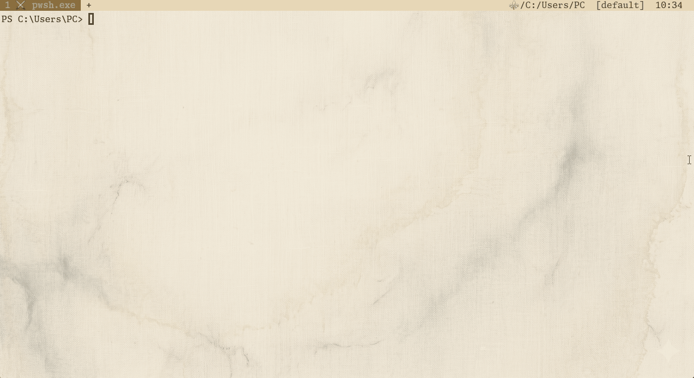

<div align="center">


<br>

[](https://github.com/NotNull92/hera-agent-unity/releases)
[](LICENSE)
[](https://go.dev)
[](https://unity.com)
[]()

**Measurement, not guessing — give AI hands on the live Editor.**

<sub>The unified successor to <code>hera-agent</code> + <code>hera-agent-pro</code>. One project. One license. All features free.</sub>

<br>



<br>

[Install](#installation) · [Quick Start](#quick-start) · [Commands](#commands) · [Batch](#batch--scripted-workflows) · [Custom Tools](#custom-tools) · [Architecture](#architecture) · [FAQ](#faq)

</div>

---

## Why hera-agent-unity

LLMs don't know your project. They remember last year's Unity API and generalized patterns — and you pay that gap every week, in tokens and in time.

**hera-agent-unity** stands between them.

Before AI guesses your code, run it in the Editor and return the result. Before AI assumes a console error, fetch the actual log filtered by type. Before AI hypothesizes a Play Mode outcome, enter it and wait until it finishes. Before AI invents an API that doesn't exist in your Unity version, reflect on the live assembly.

No middleware. No Python, no WebSocket, no JSON-RPC. One Go binary, localhost HTTP, one C# UPM package. When Unity Editor opens, Hera is already there.

Hera responds to commands — never inferring, never assuming. It returns what your Unity is, right now, exactly as it is.

> **Guessing is expensive. Measurement is the command.**

```
┌─────────────┐       HTTP        ┌──────────────────┐
│   Terminal  │ ◄──────────────► │   Unity Editor   │
│  (1 binary) │   localhost:8090  │  (auto-starts)   │
└─────────────┘                   └──────────────────┘
```

**~2,600 lines of core Go. ~3,900 lines of C#. Zero runtime dependencies.**

> Tests, TUI, batch engine, and asset-config layer add ~3,500 more lines — but the engine that talks to Unity stays lean.

---

## What's New in v2 — Unified

`hera-agent` was the free lite tier. `hera-agent-pro` was the commercial release with extra power tools. **In v2 they merge, and every former Pro feature ships free.**

| Feature                       | hera-agent (Lite) | hera-agent-pro | **hera-agent-unity v2** |
|-------------------------------|:-----------------:|:--------------:|:-----------------------:|
| Core editor control & `exec`  | ✅                | ✅             | ✅                      |
| Batch execution               | —                 | ✅             | ✅ **free**             |
| `describe_type` introspection | —                 | ✅             | ✅ **free**             |
| `find_method` / `list_assemblies` | —             | ✅             | ✅ **free**             |
| Asset Config window (GUI)     | —                 | ✅             | ✅ **free**             |
| Unity pitfalls catalog        | —                 | ✅             | ✅ **free**             |
| License                       | MIT               | Commercial     | **MIT**                 |

If you used either project before — drop the old package, install `hera-agent-unity`, keep your workflows. Tool names and CLI surface are stable.

---

## Installation

### CLI

**macOS / Linux**
```bash
curl -fsSL https://raw.githubusercontent.com/NotNull92/hera-agent-unity/main/install.sh | sh
```

**Windows** (PowerShell)
```powershell
irm https://raw.githubusercontent.com/NotNull92/hera-agent-unity/main/install.ps1 | iex
```

<details>
<summary>Other installation methods</summary>

**`go install`** (any platform)
```bash
go install github.com/NotNull92/hera-agent-unity@latest
```

**Manual** — download a release binary from [Releases](https://github.com/NotNull92/hera-agent-unity/releases), then run it once with `install` to register it on PATH:

```bash
chmod +x ./hera-agent-unity-<platform>
./hera-agent-unity-<platform> install
```

</details>

### Unity Connector

**Package Manager → Add package from git URL**
```
https://github.com/NotNull92/hera-agent-unity.git?path=AgentConnector
```

Or add to `Packages/manifest.json`:
```json
"com.notnull92.hera-agent-unity": "https://github.com/NotNull92/hera-agent-unity.git?path=AgentConnector"
```

> The connector starts automatically. No configuration. Requires Unity 6 (6000.0+).


---

## Quick Start

```bash
# Is Unity connected? — heartbeat read, no port-finding ceremony
hera-agent-unity status

# Drive Play Mode from your terminal — wait until it's actually in
hera-agent-unity editor play --wait

# Run arbitrary C# inside Unity — no recompile, no restart
hera-agent-unity exec "return EditorSceneManager.GetActiveScene().name;"

# Errors AI can act on — not screenshots
hera-agent-unity console --type error

# Multi-step workflows in one shot
hera-agent-unity batch --file workflow.json
```


---

## Hand the Wheel to Your AI Agent

Open Claude Code, Codex, Cursor — any agent that can run a shell command. Ask:

> **"Check if hera-agent-unity is installed and explore its capabilities."**

The agent will discover the CLI, run `list`, and start driving Unity.


### Compatibility

hera-agent-unity is a plain CLI returning JSON. Any coding agent that can run shell commands works. The ecosystem is converging on **`AGENTS.md` at the project root** as the canonical multi-tool rules file — start there.

| Agent                  | Canonical path                                  | Template                                                  | Notes                                                       |
|------------------------|-------------------------------------------------|-----------------------------------------------------------|-------------------------------------------------------------|
| **OpenAI Codex** + AGENTS.md-aware tools | `AGENTS.md` (project root)         | [`examples/rules/AGENTS.md`](examples/rules/AGENTS.md)    | Cross-tool standard. Lead with this.                        |
| **Claude Code CLI**    | `CLAUDE.md` (or `AGENTS.md`)                    | [`examples/rules/CLAUDE.md`](examples/rules/CLAUDE.md)    | Reads `CLAUDE.md`; expanding to also recognise `AGENTS.md`. |
| **Cursor**             | `.cursor/rules/hera-agent-unity.mdc`            | [`examples/rules/cursor.mdc`](examples/rules/cursor.mdc)  | Per-rule files with YAML frontmatter. `.cursorrules` is **deprecated**. |
| **GitHub Copilot**     | `.github/copilot-instructions.md`               | [`examples/rules/copilot-instructions.md`](examples/rules/copilot-instructions.md) | Optional: `.github/instructions/*.instructions.md` with `applyTo` frontmatter for file-pattern-specific guidance. |
| **Continue.dev**       | `.continuerules`                                | [`examples/rules/continuerules`](examples/rules/continuerules) | Plain markdown.                                             |

For multi-tool projects, the cleanest pattern is **`AGENTS.md` as the single source** plus a one-liner stub in tool-specific paths (`> See AGENTS.md.`). Cursor is the one exception — its `.mdc` files want the full body inline because the frontmatter is what makes the rule active.

### One-time setup per project (strongly recommended)

**Static** — copy the template that matches your agent:

```bash
cp examples/rules/AGENTS.md <your-unity-project>/AGENTS.md
cp examples/rules/cursor.mdc <your-unity-project>/.cursor/rules/hera-agent-unity.mdc
```

**Dynamic** — let the CLI emit the lean rule body straight into your rules file:

```bash
# AGENTS.md / CLAUDE.md / Copilot / Continue.dev — plain markdown
hera-agent-unity doctor --agent-rules >> AGENTS.md

# Cursor — frontmatter prepended automatically
hera-agent-unity doctor --agent-rules --format cursor > .cursor/rules/hera-agent-unity.mdc
```

Either path locks in the core instruction and the auto-bootstrap protocol — once installed, saying *"find hera-agent-unity"* (or the Korean equivalent) makes the agent run `doctor` + `status` and report in one line, without asking.

> **Cursor note** — Cursor's `.mdc` rule files **require YAML frontmatter** (`description`, `globs`, `alwaysApply`) or the rule is parsed but never activated. Use the template or the `--format cursor` flag — a plain markdown paste will silently no-op.

---

## Commands

| Command          | What it does                                                                  |
|------------------|--------------------------------------------------------------------------------|
| `editor`         | Play, stop, pause, refresh, recompile                                          |
| `exec`           | Run arbitrary C# inside Unity — full editor & runtime access                   |
| `log`            | Write to Unity console without the csc compile cost                            |
| `scene`          | Info, load, save, list, close                                                  |
| `console`        | Read, filter, clear logs                                                       |
| `test`           | Run EditMode / PlayMode tests                                                  |
| `menu`           | Execute any menu item by path                                                  |
| `screenshot`     | Capture Scene or Game view                                                     |
| `profiler`       | Read hierarchy, toggle recording                                               |
| `reserialize`    | Force Unity to re-serialize YAML after text edits                              |
| `describe_type`  | Reflect a live type — members, signatures, **Unity pitfalls**                  |
| `find_method`    | Search method names across loaded assemblies                                   |
| `list_assemblies`| List loaded assemblies (skip `System.*` noise by default)                      |
| `batch`          | Execute multiple commands atomically                                           |
| `list`           | List tools — slim (default), `--names`, or `--tool <name>` for full schema     |
| `status`         | Connection & project info                                                      |
| `ping`           | Token-cheap liveness probe (heartbeat read only — no HTTP)                     |
| `doctor`         | Self-diagnose: PATH, installs, shell, Unity reachability (`--json` for agents) |
| `asset-config`   | Toggle optional asset integrations (TUI / list / enable / disable / detect)    |
| `update`         | Self-update from GitHub Releases                                               |
| `install`        | Register the binary on PATH                                                    |
| `uninstall`      | Remove the CLI from PATH                                                       |

Stuck? Run `hera-agent-unity doctor`, or open [docs/TROUBLESHOOTING.md](docs/TROUBLESHOOTING.md).

---

## `exec` — Runtime C#

The most powerful command. Full editor + runtime access. Zero boilerplate.

```bash
# Evaluate
hera-agent-unity exec "return Application.dataPath;"
hera-agent-unity exec "return GameObject.FindObjectsOfType<Camera>().Length;"

# Modify the scene
hera-agent-unity exec "var go = new GameObject(\"Temp\"); return go.name;"

# ECS / custom assemblies
hera-agent-unity exec "return World.All.Count;" --usings Unity.Entities

# Pipe complex code via stdin — no shell escaping
echo '
var scene = EditorSceneManager.GetActiveScene();
return scene.GetRootGameObjects().Length;
' | hera-agent-unity exec

# Or load from file
hera-agent-unity exec --file scripts/probe.cs
```

| Flag              | Purpose                                                                      |
|-------------------|------------------------------------------------------------------------------|
| `--usings ns,...` | Add extra using directives                                                   |
| `--file <path>`   | Load code from disk (stdin and positional arg take precedence)               |
| `--csc <path>`    | Override the C# compiler path                                                |
| `--dotnet <path>` | Override the dotnet runtime path                                             |
| `--no-cache`      | Skip the compiled-assembly cache (debug only)                                |
| `--depth N`       | Limit response object graph depth                                            |

**How it works.** Code is wrapped in a static method, compiled with the system's Roslyn (`csc`) into a temporary DLL, loaded into a collectible `AssemblyLoadContext` (no leaks), invoked via reflection, and the result is JSON-serialized. Identical source code is served from an in-memory cache — warm calls skip csc entirely.

Default usings include `System`, `System.Linq`, `System.Reflection`, `UnityEngine`, `UnityEngine.SceneManagement`, `UnityEditor`, `UnityEditor.SceneManagement`, `UnityEditorInternal`.

---

## Introspection — `describe_type`, `find_method`, `list_assemblies`

These three commands read **what's actually loaded in your Unity project**, not what an LLM half-remembers from its training cutoff.

```bash
# What's loaded? (skips System.* by default)
hera-agent-unity list_assemblies
hera-agent-unity list_assemblies --filter Unity.Entities

# Inspect a type — signatures + curated Unity pitfalls
hera-agent-unity describe_type UnityEditor.EditorApplication
hera-agent-unity describe_type AssetDatabase --members methods --limit 50

# Search method names across the live AppDomain
hera-agent-unity find_method Refresh --namespace UnityEditor
```

`describe_type` returns a `pitfalls` array alongside the schema — short, stable notes paired with Unity 6 Manual links. Coverage: **Editor API**, **MonoBehaviour lifecycle**, **uGUI** (Canvas, RectTransform, EventSystem, LayoutGroup, ScrollRect, Selectable, Mask, CanvasGroup, …). Each entry is `{ text, doc_url }` so an agent gets signature + gotcha + fetchable doc in a single round-trip.

Pair with `exec` for a tight dry-run loop:

```
describe_type → write code → exec → fix → exec
```

---

## Batch — Scripted Workflows

Run multi-step pipelines in a single CLI invocation. Ideal for CI, scripted automation, or large agentic plans.

```bash
hera-agent-unity batch --file workflow.json
```

```json
{
  "commands": [
    { "command": "manage_editor", "params": { "action": "play", "wait": true } },
    { "command": "exec",          "params": { "code": "return EditorSceneManager.GetActiveScene().name;" } },
    { "command": "read_console",  "params": { "type": "error" } }
  ],
  "options": { "fail_fast": true }
}
```

Pipe JSON via stdin if you'd rather not write a file:

```bash
echo '{"commands":[{"command":"manage_editor","params":{"action":"refresh","compile":true}}]}' \
  | hera-agent-unity batch
```

`--dry-run` previews the plan without execution. `fail_fast` short-circuits on the first error and reports which step failed.

---

## Profiler

Read the live profiler from your terminal — no UI required.

```bash
hera-agent-unity profiler enable                       # start recording
hera-agent-unity profiler hierarchy                    # top-level samples (last frame)
hera-agent-unity profiler hierarchy --depth 3          # recursive drill-down
hera-agent-unity profiler hierarchy --root PlayerLoop --depth 5
hera-agent-unity profiler hierarchy --frames 30 --min 0.5 --sort self
hera-agent-unity profiler disable                      # stop recording
hera-agent-unity profiler status
hera-agent-unity profiler clear
```

| Flag              | Purpose                                              |
|-------------------|------------------------------------------------------|
| `--depth N`       | Recursion depth (0 = unlimited, default: 1)          |
| `--root <name>`   | Substring-match root sample                          |
| `--frames N`      | Average over the last N frames                       |
| `--from N --to N` | Average over an explicit frame range                 |
| `--parent ID`     | Drill into an item by ID                             |
| `--min <ms>`      | Filter items below threshold                         |
| `--sort <col>`    | `total` (default), `self`, `calls`                   |
| `--thread N`      | Thread index (0 = main)                              |

---

## Custom Tools

Drop a C# class anywhere in your Editor assembly. It is discovered automatically — no registration, no codegen.

```csharp
using HeraAgent;
using Newtonsoft.Json.Linq;
using UnityEngine;

[HeraTool(Name = "spawn", Group = "gameplay", Description = "Spawn a prefab at a position")]
public static class SpawnEnemy
{
    public class Parameters
    {
        [ToolParameter("X world position", Required = true)] public float  X      { get; set; }
        [ToolParameter("Y world position", Required = true)] public float  Y      { get; set; }
        [ToolParameter("Z world position", Required = true)] public float  Z      { get; set; }
        [ToolParameter("Prefab name",      Default = "Enemy")] public string Prefab { get; set; }
    }

    public static object HandleCommand(JObject args)
    {
        var p      = new ToolParams(args);
        var prefab = Resources.Load<GameObject>(p.Get("prefab", "Enemy"));
        var inst   = Object.Instantiate(prefab,
                        new Vector3(p.GetFloat("x"), p.GetFloat("y"), p.GetFloat("z")),
                        Quaternion.identity);
        return new SuccessResponse("Spawned", new { name = inst.name });
    }
}
```

Call it:
```bash
hera-agent-unity spawn --x 1 --y 0 --z 5 --prefab Goblin
```

**Rules**
- Decorate with `[HeraTool]`
- Expose `public static object HandleCommand(JObject parameters)` (instance methods also work)
- Return `SuccessResponse(message, data)` or `ErrorResponse(message)`
- Use `{ get; set; }` properties in `Parameters` — fields are invisible to the schema generator
- Class name auto-converts to `snake_case` (`SpawnEnemy` → `spawn_enemy`); override with `Name =`
- Discovered on Editor start and after every script recompile
- Runs on Unity's main thread — every API is safe
- Duplicate tool names are flagged in the console; first registration wins

`hera-agent-unity list` exposes the parameter schema so agents can discover and call your tools without reading source.

---

## Architecture

```
┌──────────────────┐           ┌──────────────────────────────────┐
│    CLI (Go)      │           │         Unity Editor             │
│                  │   HTTP    │                                  │
│  ┌────────────┐  │  POST     │  ┌────────────┐                  │
│  │  Discover  │──┼──/command─┼─►│ HttpServer │ (localhost:8090+)│
│  │  Instance  │  │           │  └─────┬──────┘                  │
│  └──────┬─────┘  │           │        │ ConcurrentQueue         │
│         │ read   │           │  ┌─────▼──────┐                  │
│  ┌──────▼─────┐  │           │  │  Command   │ EditorApplication│
│  │ Heartbeat  │  │           │  │  Router    │ .update           │
│  │   files    │◄─┼───write───┼──│            │ (main thread)    │
│  │ (instance) │  │           │  └─────┬──────┘                  │
│  └────────────┘  │           │        │ SemaphoreSlim(1,1)      │
│                  │           │  ┌─────▼──────┐                  │
│  ┌────────────┐  │           │  │    Tool    │ [HeraTool]       │
│  │  Backoff   │  │           │  │ Discovery  │ reflection       │
│  │  Polling   │  │           │  └─────┬──────┘                  │
│  └────────────┘  │           │  ┌─────▼──────┐                  │
│                  │           │  │  Handlers  │ exec, editor,    │
│                  │           │  │            │ test, profiler…  │
└──────────────────┘           │  └────────────┘                  │
                               └──────────────────────────────────┘
```

| Principle                          | What it means                                                                                          |
|------------------------------------|--------------------------------------------------------------------------------------------------------|
| **Stateless**                      | Every request is independent. No sessions, no reconnect logic.                                         |
| **Auto-discovery**                 | Scans `~/.hera-agent-unity/instances/` heartbeat files. Matches by CWD, project, or port.              |
| **Domain-reload safe**             | `[InitializeOnLoad]` + assembly-reload events survive script recompiles.                               |
| **Main-thread execution**          | All tool handlers marshal through `ConcurrentQueue` + `EditorApplication.update`.                      |
| **Filesystem cross-process bus**   | Heartbeat + test-result files survive HTTP server tear-down during domain reloads.                     |
| **Atomic writes**                  | Heartbeats are written to `.tmp` then renamed — readers never see a half-written JSON.                 |

### Engineered for AI agents

- **Function-typed DI in Go.** Command handlers receive `sendFn` and `instanceResolver` as injected functions. The `resolve` closure re-discovers the instance on every call, so domain reloads that rebind the HTTP port are absorbed transparently.
- **Three-phase orchestration.** Compile-triggering commands do `waitForAlive` → send → `waitForReady`. Polling uses a 1.5× backoff (100ms → 2s cap) — finer than the usual 2× because Unity often returns to ready faster than that.
- **Compile grace period.** `editor refresh --compile` keeps `state == "compiling"` pinned for 3 s so polling doesn't latch onto a stale `"ready"` before Unity actually starts the compile.
- **PlayMode test polling.** PlayMode tests trigger a domain reload that destroys the HTTP server. Results are written to `~/.hera-agent-unity/status/test-results-<port>.json` and polled at 500 ms.
- **Atomic self-update.** GitHub Releases → backup → rename → cleanup with rollback. Windows defers `.bak` deletion to a spawned PowerShell because the running `.exe` is locked.

---

## Compared to MCP

|                       | MCP integrations                  | hera-agent-unity                          |
|-----------------------|-----------------------------------|-------------------------------------------|
| **Install**           | Python + uv + FastMCP + config    | Single binary                             |
| **Runtime deps**      | WebSocket relay, persistent proc  | None                                      |
| **Protocol**          | JSON-RPC 2.0 over stdio           | Direct HTTP POST                          |
| **Setup**             | Generate config, restart client   | Add UPM package, done                     |
| **Domain reload**     | Complex reconnect logic           | Stateless (filesystem bus)                |
| **Custom tools**      | `[Attribute]` pattern             | Same `[Attribute]` pattern                |
| **Compatibility**     | MCP clients only                  | Any shell, any agent, any script          |
| **Multi-instance**    | Manual setup                      | CWD / project / port auto-discovery       |

---

## Global Flags & Environment

```bash
--port <N>          # Select Unity instance by active heartbeat port
--project <path>    # Select Unity instance by project path (substring match)
--timeout <ms>      # Request timeout (default: 60000)
--verbose           # Per-phase timings + progress to stderr
```

| Environment variable          | Purpose                                              |
|-------------------------------|------------------------------------------------------|
| `HERA_AGENT_NO_PATH_CHECK=1`  | Silence the per-command PATH warning                 |
| `GITHUB_TOKEN`                | Auth for `update` against private mirrors            |

---

## FAQ

<details>
<summary><strong>Unity says "port 8090 is taken."</strong></summary>

The connector probes 8090, 8091, 8092, … up to 10 attempts. If all are occupied, look for zombie Unity processes or another local service holding the port. The CLI reads the real port from the heartbeat file — port numbers are transparent to you.

</details>

<details>
<summary><strong>Commands hang when Unity is minimized.</strong></summary>

They shouldn't — the connector calls `RepaintAllViews()` after every enqueue so the update loop runs even unfocused. If it still happens, check that the UPM package is installed and the Unity console shows `[Hera] HTTP server started on port XXXX`.

</details>

<details>
<summary><strong>`exec` fails with "Cannot find csc compiler."</strong></summary>

The compiler is auto-detected from .NET SDK, Visual Studio, or Unity's bundled Roslyn. If none are visible, install the [.NET SDK](https://dotnet.microsoft.com/download) or point at the compiler explicitly:

```bash
hera-agent-unity exec "return 1+1;" --csc "C:\Program Files\dotnet\sdk\8.0.100\Roslyn\bincore\csc.dll"
```

</details>

<details>
<summary><strong>How does it pick an instance when multiple Unity editors are open?</strong></summary>

Priority order:
1. `--port` flag (explicit)
2. `--project` flag (path substring match)
3. Current working directory matches a known project path
4. Most recent heartbeat timestamp (fallback)

</details>

<details>
<summary><strong>Is it safe to use in CI?</strong></summary>

Yes — `batch` was designed for it. Exit codes propagate per command; `fail_fast` short-circuits on the first error. The `update` command and version notice can be silenced for non-interactive runs.

</details>

<details>
<summary><strong>I was using `hera-agent` or `hera-agent-pro`. How do I migrate?</strong></summary>

1. Uninstall the old CLI (`hera-agent uninstall` or `hera-agent-pro uninstall`).
2. Remove the old UPM package from Unity (`com.notnull92.hera-agent` / `com.notnull92.hera-agent-pro`).
3. Install `hera-agent-unity` (CLI + UPM).
4. Tool names and CLI surface are stable — your scripts and agent rules keep working with a name swap.

</details>

---

## Projects Using Hera

| Project                                                          | Description                                                                                       |
|------------------------------------------------------------------|---------------------------------------------------------------------------------------------------|
| [**NoMoreRolls**](https://github.com/NotNull92)                  | Solo-developed Unity game — 3-tier architecture, 9-soul combat system. Built with hera-agent-unity. |

> Want yours listed? Open an issue or PR.

---

## Author

**Victor** — Unity/C# developer, 6+ years of live-service MMORPG production.
Building [NoMoreRolls](https://github.com/NotNull92) solo with [hera-agent-unity](https://github.com/NotNull92/hera-agent-unity) · [IndieAlchemist](https://www.youtube.com/@IndieAlchemist) on YouTube.

[](https://github.com/NotNull92)
[](mailto:fatiger92@gmail.com)

## Sponsors

hera-agent-unity is free and open source. If it saves you time or tokens, consider [sponsoring](https://github.com/sponsors/NotNull92).

Your support directly funds:
- New engine support (Godot, Unreal)
- Deeper agent integrations (Cursor, Windsurf, …)
- Documentation, video tutorials, sample projects

## License

MIT — see [LICENSE](LICENSE).
