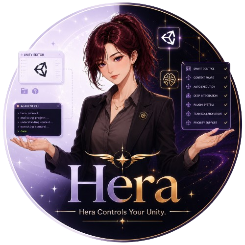
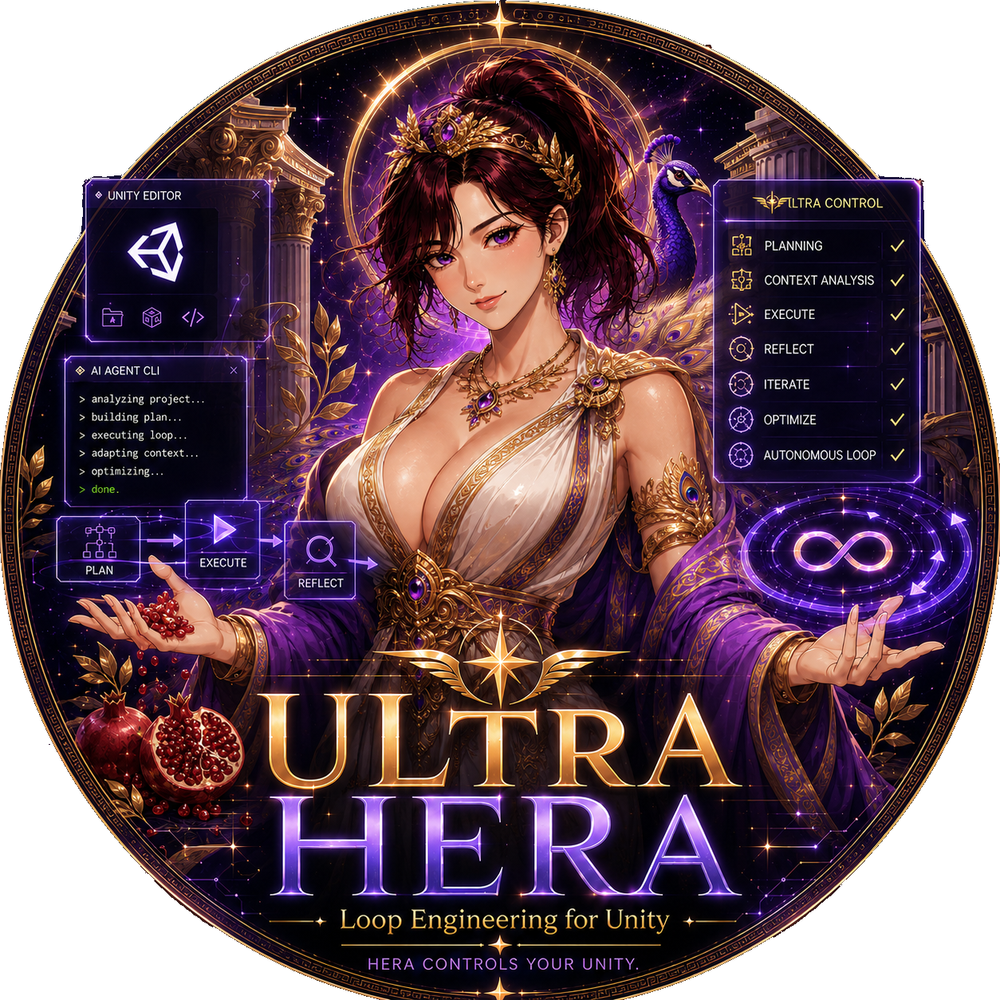

<div align="center">



<br>

[](https://github.com/NotNull92/hera-agent-unity/releases)
[](https://github.com/NotNull92/hera-agent-unity/stargazers)
[](LICENSE)
[](https://go.dev)
[](https://unity.com)
[]()

**Low-token Unity Editor control for AI coding agents.**

<sub>Let Codex, Claude, Cursor, Copilot, and AntiGravity inspect and change your live Unity project — no MCP setup for the default CLI path, no Python server.</sub>

<br>

[Start in 60 seconds](#quick-start) · [Install](#install) · [UI systems](#ui-systems) · [Commands](#commands) · [Full docs](docs/COMMANDS.md)

<sub>[What's new](#whats-new) · [Verification](#ultra-hera) · [Agent rules](#add-project-rules-for-agents) · [FAQ](#faq)</sub>

**English** · [한국어](README.ko.md)

</div>

---

## What It Is

`hera-agent-unity` is a low-token CLI that lets AI coding agents control a running Unity Editor.

Think of it like a remote control for the live Editor:

| You want the AI to... | Hera lets it... |
|:---|:---|
| See if Unity is open | ask the real Editor |
| Run C# code | run it inside your loaded project |
| Check console errors | read the actual Unity Console |
| Enter Play Mode | press Play and wait |
| Create or edit objects | use Unity APIs safely |
| Build UI | create real Unity UI objects and capture the result |
| Verify UI input | send Unity EventSystem events without relying on screen coordinates |

The AI does not need to guess from stale training data. It can inspect the real Editor, act on it, and check the result.

```text
AI agent  ->  hera-agent-unity  ->  Unity Editor
```

---

## Why It Helps

AI often makes mistakes in Unity because it cannot see your Editor.

It may guess:

- which scene is open;
- which objects exist;
- which Unity API exists in your version;
- whether Play Mode works;
- what error is in the console.

Hera fixes that by letting the AI ask Unity directly.

```bash
hera-agent-unity status
hera-agent-unity console --type error
hera-agent-unity exec "return Application.unityVersion;"
hera-agent-unity editor play --wait
```

No Python server. The production-default CLI path needs no MCP config or special
agent plugin. CLI `v0.1.0+` also includes an experimental, default-off stdio MCP
adapter for intentionally configured MCP clients. See
[docs/MCP.md](docs/MCP.md) for setup and compatibility boundaries.

---

## What's New

### v0.1.2 - package-backed MCP discovery

This patch publishes the existing default-off stdio MCP adapter through the
official MCP Registry without changing the Unity Connector or normal CLI path.

| Release change | What it means |
|:---|:---|
| Official MCP identity | `io.github.notnull92/hera-agent-unity` links the registry entry to the public npm package. |
| Reproducible local launch | Registry clients receive the fixed `mcp --transport stdio --profile core` arguments and `HERA_MCP_ENABLED=1` opt-in. |
| Ordered trusted publication | GitHub Actions publishes npm first, then uses GitHub OIDC and a checksum-pinned publisher for the MCP Registry. |
| Connector unchanged | The released Unity package remains Connector 0.0.80; CLI and Connector versions stay independent. |

### v0.1.1 - hardened contracts, recovery, and release evidence

This release tightens the completed CLI + optional MCP architecture without
replacing its proven Unity execution core.

| Release change | What it means |
|:---|:---|
| Versioned execution metadata | Current single-command clients send `hera.execution/1`; unsupported future versions fail before approval, journaling, or Unity execution. |
| Stronger recovery boundaries | Stale catalogs, abandoned ledger entries, partial Hera Settings reads, stale config locks, and uncertain mutation timeouts now fail or recover explicitly. |
| Smaller Compact discovery | `tool_describe` can return one action contract instead of an entire multi-action tool; the largest measured case is about 92% smaller. |
| Repeatable release gates | Generated Go/C# contract drift, five Unity compile buckets, isolated NUnit package tests, race tests, and catalog payload budgets have reproducible checks. |
| Connector 0.0.80 | The UPM package carries the matching runtime hardening and release-gate changes; CLI and Connector versions remain independent. |

The normal CLI remains the production default. MCP remains optional,
default-off, and stdio-only.

### v0.1.0 — safe multi-Editor targeting and an optional MCP adapter

This release completes the M0-M17 adapter migration without replacing the
normal CLI. MCP is shipped as an experimental, stdio-only, environment-gated
option; the typed CLI and localhost Unity Connector remain the production
default.

#### Why make this migration?

More AI applications now speak MCP as a common way to discover and call tools.
Hera already had a small, efficient CLI and a proven Unity execution path, so
rebuilding the product around MCP would have duplicated that work and changed a
workflow that existing users rely on. Instead, v0.1.0 adds a thin translator at
the edge: an MCP-capable AI can speak its familiar protocol while Hera keeps
executing the same validated CLI and Connector operations underneath.

Think of the CLI as Hera's compact dedicated remote control. The MCP adapter is
a small plug converter that lets a different device use that remote; it does
not replace the remote with a larger control panel.

#### How does it work?

The path is `AI client → optional MCP adapter → existing Hera execution core →
localhost Connector → the selected Unity Editor`. The adapter searches and
describes tools, validates the requested operation, applies the same safety
policy, and then hands the call to Hera's existing execution path. It does not
open Unity to the network, replace the Connector, or silently relax approvals.
Unsupported approval or operation-ledger features fail closed instead of
guessing that an operation is safe.

#### Does it make Hera more accurate?

MCP by itself does not make an AI smarter, and the adapter does not use a
different Unity execution engine. Accuracy improves at the delivery layer: an
exact normalized project path prevents a request from drifting to another open
Editor; strict live contracts reject malformed or outdated arguments; and a
fresh heartbeat distinguishes a domain reload, an Editor restart, a lost
target, and a port that another project has taken over. Operation IDs and the
Connector ledger also prevent an uncertain response from becoming the same
mutation twice.

In everyday terms, Hera now checks both the full delivery address and the
receipt before acting. That reduces wrong-project calls, invalid requests, and
duplicate changes. It does **not** guarantee that the AI's design decision is
correct, replace Unity tests, or prove a numerical accuracy improvement. No
repository benchmark currently supports an “X% more accurate” claim; the
measurable promise is narrower: detect more ambiguous or stale connection
states and stop safely instead of guessing.

The first retained end-to-end game-creation run is the
[Crystal Forge real-world benchmark](docs/benchmarks/user-scenario/crystal-forge-6000.3.5f2.md).
It reached the correct playable result only after several repairs; first
attempt success was **not** achieved. It is a regression baseline, not an
MCP-versus-CLI A/B result or proof of higher model accuracy.

#### Does it use more tokens?

The normal CLI path has no new token cost because it has not changed. MCP adds
some unavoidable protocol metadata, so token use is **not guaranteed to be
identical** and depends on the AI client and the task. Hera limits that overhead
in two ways: Profile exposes a small, stable native surface, while Compact MCP
registers only three gateway tools — search, describe, and call — and fetches a
tool's details only when they are needed. The large Full surface remains an
explicit diagnostic option rather than the default.

There is not yet a repository benchmark that proves exact CLI/MCP token parity.
The design goal is therefore honest and narrower: preserve the CLI's current
cost, and make MCP compatibility pay as little up-front context cost as
possible.

#### Why borrow Compact MCP if Hera is CLI-first?

Hera's principle is low-token, verifiable Unity control — not loyalty to one
protocol. Refusing MCP completely would isolate Hera from compatible AI hosts;
adopting a conventional “register every tool” MCP design would send a large
catalog of names, descriptions, and schemas into context before most of it was
needed. v0.1.0 deliberately uses MCP only as the outside language and keeps the
CLI as the production core. Compact exposure preserves the original philosophy
by making compatibility on-demand instead of turning compatibility into a
permanent token tax.

| Release change | What it means |
|:---|:---|
| Project-aware Editor selection | Full normalized project paths identify Editors; ports are treated as temporary endpoints and ambiguous matches fail. |
| Safe response-loss recovery | Hera detects domain reloads, Editor restarts, lost targets, and port reuse before any eligible retry. Non-idempotent mutations are never blindly repeated. |
| Experimental MCP adapter | `HERA_MCP_ENABLED=1 hera-agent-unity mcp` exposes Profile, Compact, Full-safe, approval, operation-ledger, Tasks, and bounded result-resource paths. |
| Connector 0.0.76 packaging | UPM tests are isolated from production assemblies, removing the Unity 6000.5 compile-stall regression and duplicate TestRunner references. |
| Apache-2.0 | The project now carries explicit patent terms, modification notices, and distributable `NOTICE` files. |

### Unity De-slop Mode (Beta) — static visual discipline

Game Feel Mode covers how a screen moves. De-slop Mode covers how it sits
still: the tells that make generated UI look generated. The taxonomy ships
inside the connector (**0.0.63** and up), so there is nothing to fetch.

| What it does | Why it works that way |
|:---|:---|
| 49 tells across five areas, fixed in order A → B → C → D → E | An upstream fix dissolves the conflicts a downstream one would hit |
| Every tell carries a uGUI *and* a UI Toolkit check | The UI Toolkit side is written against the USS vocabulary each Unity version actually ships |
| Findings are predicates, re-measured against the live scene | A checklist that stores "done" goes stale; one that measures cannot |
| Spacing and type scales resolve against a 1280x720 reference | Absolute pixels mean nothing until the reference resolution is stated |
| Repeated interactive cells are never flattened | Nested surfaces in game UI are usually functional — inventory slots, hotbars, HUD panels |

[Read the mode →](#unity-de-slop-mode-beta) · [Game Feel Mode →](#game-feel-mode-beta)

### UI Toolkit scaffolding, grounded in the live Editor

Connector **0.0.61** added a first-class UI Toolkit path without asking an
agent to guess version-specific APIs.

| Choose | Hera does | Built-in boundary |
|:---|:---|:---|
| `ugui` (default) | Keeps the Canvas / GameObject / RectTransform workflow | Existing uGUI pipeline |
| `uitk` | Emits validated `.uxml`, shared `.hera-*` `.uss`, `PanelSettings`, and `UIDocument` | Runtime-only reflected elements, UXML attributes, and USS properties |
| World-space | Enables it only on live Unity 6000.2+ | Never inferred from a documentation bucket |
| v1 scope | Focuses on layout scaffolding | MVVM and data binding are intentionally out |

[Choose a UI system →](#ui-systems) · [Read the UI document contract →](docs/UI_DOC_IR.md)

### Latest CLI release - v0.1.2

The latest published CLI release is **v0.1.2** (August 4, 2026). Its released
Unity package is **Connector 0.0.80**. CLI and connector versions are
intentionally separate.

| Current highlight | Simple meaning |
|:---|:---|
| **Versioned and stale-safe execution** | Requests carry an explicit execution version and live catalog hash, so incompatible or outdated calls stop before Unity changes. |
| **Smaller Compact discovery** | Action-specific describe avoids returning unrelated action contracts while preserving the existing full-tool form. |
| **Recovery hardening** | Ledger, settings, config-lock, timeout, and MCP lifecycle states now have explicit fail-closed behavior. |
| **Repeatable release evidence** | Five Unity compile buckets and the isolated Connector NUnit gate are automated and leave fixture manifests unchanged. |
| **MCP Registry discovery** | The npm package carries verified MCP ownership metadata and a reproducible local stdio launch contract. |

Release compatibility matrix:

| Unity Editor | Connector 0.0.80 exact-source compile |
|:---|:---:|
| 2022.3.62f2 | PASS |
| 2023.2.22f1 | PASS |
| 6000.0.35f1 | PASS |
| 6000.3.5f2 | PASS |
| 6000.5.6f1 | PASS |

The preceding Connector 0.0.75 also passed clean UPM import and runtime checks
across the same matrix. Evidence: [Unity compatibility inventory](docs/UNITY_EDITOR_VERSION_INVENTORY.md)

Low-token benchmark baseline:

| Unity Editor | `list --compact` | `find_gameobjects --ids` | Details |
|:---|---:|---:|:---|
| 2022.3.62f2 | **93 T** | **54 T** | [benchmark](docs/benchmarks/token-reduction/2022.3.62f2.md) |
| 2023.2.22f1 | **93 T** | **54 T** | [benchmark](docs/benchmarks/token-reduction/2023.2.22f1.md) |
| 6000.3.5f2 | **93 T** | **49 T** | [benchmark](docs/benchmarks/token-reduction/6000.3.5f2.md) |
| 6000.5.0f1 | **93 T** | **55 T** | [benchmark](docs/benchmarks/token-reduction/6000.5.0f1.md) |

Full benchmark notes: [docs/benchmarks/token-reduction/README.md](docs/benchmarks/token-reduction/README.md)

---

## Quick Start

### 1. Open Unity

Open a Unity project that has the Hera Unity package installed.

### 2. Check the connection

```bash
hera-agent-unity status
```

You should see the project name, Unity version, port, and state.

### 3. Ask your AI agent to use it

Example prompt:

```text
Use hera-agent-unity. Check the Unity console, enter Play Mode, reproduce the issue, and fix it.
```

The agent can then run commands like:

```bash
hera-agent-unity console --type error
hera-agent-unity editor play --wait
hera-agent-unity exec "return EditorSceneManager.GetActiveScene().name;"
hera-agent-unity test --mode PlayMode
```

---

## Install

There are two parts:

1. the CLI program on your computer;
2. the Unity package inside your project.

### CLI

**npm (Windows, macOS, Linux)**

```bash
npm install --global hera-agent-unity
```

**Windows PowerShell**

```powershell
powershell -ExecutionPolicy ByPass -c "irm https://raw.githubusercontent.com/NotNull92/hera-agent-unity/main/install.ps1 | iex"
```

Open a new terminal after install, then check:

```powershell
hera-agent-unity version
```

**macOS / Linux**

```bash
curl -fsSL https://raw.githubusercontent.com/NotNull92/hera-agent-unity/main/install.sh | bash
```

**Go install**

```bash
go install github.com/NotNull92/hera-agent-unity@latest
```

**Manual**

Download a binary from [Releases](https://github.com/NotNull92/hera-agent-unity/releases), then run:

```bash
hera-agent-unity install
```

### Unity Package

In Unity:

```text
Window -> Package Manager -> Add package from git URL
```

Use this URL:

```text
https://github.com/NotNull92/hera-agent-unity.git?path=AgentConnector
```

Or add this to `Packages/manifest.json`:

```json
"com.notnull92.hera-agent-unity": "https://github.com/NotNull92/hera-agent-unity.git?path=AgentConnector"
```

To pin a specific connector (UPM) version instead of tracking the latest, append
an existing `connector-<version>` git tag:

```json
"com.notnull92.hera-agent-unity": "https://github.com/NotNull92/hera-agent-unity.git?path=AgentConnector#connector-<version>"
```

Connector versions are separate from CLI `v*` releases.

The connector starts by itself when Unity opens.

---

## Commands

Here are the commands most agents use first.

| Command | What it does |
|:---|:---|
| `status` | Shows which Unity Editor is connected. |
| `doctor --json` | Checks install, PATH, and Unity connection. |
| `list --compact` | Lists tools with a small response. |
| `call <tool> --json '{...}'` | Validates a strict live tool contract, then invokes it. |
| `console --type error` | Reads real Unity errors. |
| `exec "..."` | Runs C# inside Unity. |
| `editor play --wait` | Enters Play Mode and waits. |
| `editor stop --wait` | Stops Play Mode and waits. |
| `scene info` | Shows the active scene. |
| `find_gameobjects` | Finds objects in the loaded scenes. |
| `manage_assets` | Finds, makes folders, authors ScriptableObject `.asset` files, copies, moves, or deletes project assets under `Assets/`. |
| `manage_gameobject` | Creates, duplicates, moves, renames, parents, or deletes GameObjects. |
| `manage_components` | Adds, removes, reads, or edits components. |
| `manage_animation` | Authors AnimationClips and AnimatorController state machines. |
| `ui_doc` | Builds uGUI or UI Toolkit scaffolding; captures live uGUI overlays. |
| `input` | Verifies uGUI interaction through Unity EventSystem raycasts and pointer handlers. |
| `game_feel` | Looks up game-feel recipes (screen shake, hit stop, honest juice, ...). |
| `ui_slop` | Looks up UI-slop tells and their fixes (decoration, layout, spacing, typography, color). |
| `test` | Runs Unity tests. |
| `screenshot` | Captures Scene/Game view or one isolated GameObject. |
| `batch` | Runs several commands in one request (optionally atomic). |

Full command list: [docs/COMMANDS.md](docs/COMMANDS.md)

---

## Token Saving

Hera is built for agents, so small answers matter.

Big answers become input tokens. Input tokens cost money and fill context. So common Hera commands return small data by default.

Good default path:

```bash
hera-agent-unity list --compact
hera-agent-unity find_gameobjects --name Player --ids
hera-agent-unity list --tool manage_gameobject
```

Use bigger output only when needed:

```bash
hera-agent-unity list
hera-agent-unity find_gameobjects --fields all
hera-agent-unity console --lines 0 --stacktrace full
```

---

## Unity UI From a Screenshot

Unity UI is hard for AI because anchors, pivots, and layout groups are easy to guess wrong.

Hera gives the AI a loop:

1. read the current UI;
2. build real Unity UI objects;
3. capture what Unity rendered;
4. compare and fix.

```bash
hera-agent-unity ui_doc export --path /Canvas/HUD
hera-agent-unity ui_doc sample --image hud_ref.png --region "0,0,1,0.2"
hera-agent-unity ui_doc apply --file hud.json --parent /Canvas --mode upsert
hera-agent-unity ui_doc capture --out hud_built.png
```

This is the main idea: do not guess the UI. Measure it. During `ui_doc apply`,
Hera also reports the active official uGUI docs bucket (`2022.3`, `2023.2`,
`6000.0`, `6000.3`, or `6000.5`), deterministic `fixes`, and remaining
`diagnostics` so the agent can correct version-specific uGUI structure.

---

## UI Systems

`ui_system` makes the output backend explicit. Set it in `asset-config.json`;
each UI request stays within the selected backend. Hera never guesses from the
scene or silently switches systems; a mismatched `ui_doc.backend` is rejected
before any scene or asset mutation.

| Backend | Best for | Hera emits |
|:---|:---|:---|
| `ugui` (default) | Canvas-based UI | GameObjects and RectTransforms |
| `uitk` | Runtime UI Toolkit layout | Validated UXML, shared USS, `PanelSettings`, and `UIDocument` |

Choose `uitk` when the project uses runtime UI Toolkit:

```bash
hera-agent-unity asset-config ui-system uitk
hera-agent-unity ui_doc apply --file settings-uitk.json
```

The UITK document uses `backend: "uitk"`, exact runtime element names,
reflection-validated UXML attributes, and reflection-validated USS properties.
Generated files live under `Assets/HeraGenerated/UI`.

| Requirement | UI Toolkit v1 behavior |
|:---|:---|
| Screen-space | Default on every supported Editor |
| World-space | Only on live Unity runtime 6000.2+; independent of the documentation-bundle bucket |
| Validation | Exact reflected runtime element, attribute, and USS-property schema |
| Data binding | Intentionally out of scope in v1 |

See [UI_DOC_IR.md](docs/UI_DOC_IR.md) for both backend contracts.

---

## Input QA

Some agent environments cannot capture a reliable Unity screenshot state, so they refuse physical coordinate clicks. Hera's `input` command gives agents a separate Unity-level QA path.

```bash
hera-agent-unity input state
hera-agent-unity input inspect --path /Canvas/StartButton --details true
hera-agent-unity input click --path /Canvas/StartButton --settle_frames 2
hera-agent-unity input submit --path /Canvas/StartButton
hera-agent-unity input scroll --path /Canvas/ScrollRect --scroll_delta 0,-3
hera-agent-unity input drag --path /Canvas/Slider/Handle --to_normalized 0.8,0.5
```

`input` uses Unity's uGUI `EventSystem.RaycastAll` and `ExecuteEvents` pointer handlers. It can prove that the Unity UI event path works, including blockers, handlers, interactability, submit, scroll, and drag behavior.

Input work and diagnostics are bounded before dispatch: `hold_ms` ≤ 5000, `settle_frames` ≤ 120, `steps` ≤ 120, `click_count` ≤ 3, and `max_results` ≤ 100 (default 50). Invalid values return `INPUT_INVALID_PARAM`.

It is not a physical OS/window click. Report evidence separately:

| QA criterion | How to report |
|:---|:---|
| Unity EventSystem input QA | PASS/FAIL from `input inspect`, `input click`, callbacks, console logs, and Play Mode tests. |
| Physical OS click QA | BLOCKED if Computer Use still cannot capture Unity screenshot state or use a native window input backend. |

Detailed command docs: [docs/COMMANDS.md](docs/COMMANDS.md#input)

---

## Game Feel Mode (Beta)

AI can make a game that works. Game Feel Mode (Beta) helps it make a game that *feels* right.

When this mode is on, agents working through Hera get game-feel guidance for gameplay itself — screen shake, hit stop, knockback, control feel (coyote time, input buffering), camera work, sound design, reward presentation — with concrete parameters (px, seconds, %, Hz) from the *Game Feel & Juice Bible* and the *Ethical Engagement Game Feel Framework*.

The ethics are built in, not bolted on. Every recipe carries its constraints — screen-shake intensity options, flash-reduction for photosensitivity, honest reward presentation, transparent probabilities — so what the agent builds passes the ethics checklist by construction (**Honest Juice**: presentation intensity must match real achievement).

Three surfaces work together:

- `hera-agent-unity game_feel <topic>` — the bundled knowledge base (54 topics, ethics listed first), always available
- `doctor --agent-rules` — injects the core principles + workflow when the mode is on
- Tool hints — adding a Camera / ParticleSystem / AudioSource / Rigidbody / Light / Animator via `manage_components` points the agent at the matching topics

Guidance only — Hera never attaches runtime components for you.

Turn it on in Unity:

```text
HeraAgent -> Hera Settings -> Game Feel Mode (Beta)
```

Or from the CLI: `hera-agent-unity asset-config gamefeel on`

---

## Game Feel UI Mode (Beta)

AI can make a button that works. Game Feel UI Mode (Beta) helps it make a button that feels like a game.

When this mode is on, Hera adds an `agent_hint` to UI creation results. The hint gives concrete game-feel recipes: hover scale, press squash, release bounce, popup overshoot with symmetric choice buttons, rarity-laddered reward presentation, count-up numbers with critical specs, dual-response health bars, charge/cooldown patterns, ECN-DMN density guidance, haptics, and accessibility baselines. Each hint ends with a pointer into the `game_feel` knowledge base's `ui` category — per-element spec tables, cognitive-load theory, choice-symmetry ethics, and 2026 trends — for depth on demand.

It is guidance, not runtime bloat. Hera does not attach heavy gameplay components for you. The agent receives the recipe, then applies the animation or feedback through normal Unity edits.

The uGUI fixer is separate from the game-feel recipe: `ui_doc apply` always reports
manual-backed `fixes` / `diagnostics`, while Game Feel UI Mode (Beta) only adds optional
game-feel guidance in `agent_hint`.

Turn it on in Unity:

```text
HeraAgent -> Hera Settings -> Game Feel UI Mode (Beta)
```

Or from the CLI: `hera-agent-unity asset-config gamefeel-ui on`

If DOTween is enabled in the same Hera Settings panel, the hint suggests DOTween-style tweens. If not, it falls back to coroutine or lerp-style guidance.

Common recipes:

| UI element | Game-feel guidance |
|:---|:---|
| Button | Hover grow, press squash, release bounce, click sound, haptic. |
| Popup / panel | Pop-in entrance, screen dim, fast quiet exit. |
| Text | Staggered text, count-up numbers, floating damage text. |
| Image / reward | Pop-in, rarity pulse, glow, hover lift. |
| Bar | Instant fill drop, delayed chip bar, low-value pulse, segment ticks. |

Detailed command docs: [docs/COMMANDS.md](docs/COMMANDS.md#ui_doc)

---

## Unity De-slop Mode (Beta)

Game Feel Mode covers how a screen *moves*. De-slop Mode covers how it *sits still* — the statistical tells that make generated UI look generated: reflexive decoration, undisciplined containers, spacing picked by eye, decorative italics, rainbow palettes.

The bundled `ui_slop` taxonomy groups these into five areas, and fixes land in that order so an upstream fix dissolves the conflicts a downstream one would hit:

| Area | Covers |
|:---|:---|
| A | Decorative sweep — orbs, glow, glass, sparkles, emoji icons |
| B | Layout, RectTransform, containers, anchors, raycast targets |
| C | Spacing — the ladder, density, grouping, dead whitespace |
| D | Typography — italics, font roles, type scale, Hangul typesetting |
| E | Color — semantic roles, palette discipline, WCAG contrast |

Every tell carries a uGUI check and a UI Toolkit check, written against the USS vocabulary each Unity version actually ships, plus the mechanical fix and the functional cases that must *not* be treated as slop — nested surfaces are usually legitimate in game UI, so repeated interactive cells like inventory slots are never flattened.

```bash
hera-agent-unity ui_slop                 # taxonomy index by area
hera-agent-unity ui_slop box-in-box      # one tell: check, exception, fix
```

The tool is always available. Turning the mode on additionally makes `doctor --agent-rules` inject the de-slop discipline and `manage_components add` point at the relevant tell:

```text
HeraAgent -> Hera Settings -> Unity De-slop Mode (Beta)
```

Or from the CLI: `hera-agent-unity asset-config uislop on`

---

## Ultra Hera

<div align="center">



<br>

**Hera's signature verification mode for AI-assisted Unity work.**

<sub>Ultra Hera helps an AI agent check its Unity work before it says "done".</sub>

</div>

Ultra Hera is Hera's safety belt for AI Unity work.

When an AI changes code, a scene, or the Inspector, it can be wrong in small ways: Unity may not compile, the Console may have errors, a GameObject may not have the component you expected, or Play Mode may fail after the edit.

Ultra Hera gives the agent a simple rule:

```text
Do the work. Check the work. Only then report the result.
```

It does not replace the AI. It tells the AI how carefully to verify Unity work after using Hera.

Find it here:

```text
HeraAgent -> Hera Settings -> Ultra Hera
```

Modes:

| Mode | Simple meaning |
|:---|:---|
| `Off` | No extra checking rule. |
| `Light` | Default. The agent does a small check after every Unity task, so it does not finish in a clearly wrong state. |
| `Ultra` | The agent uses Light checks for every task, then upgrades important requests to stronger checks like tests, Play Mode, Inspector reads, screenshots, or `ui_doc` capture. |

Think of the modes like this:

| Mode | Like a... | What it checks |
|:---|:---|:---|
| `Light` | Quick seatbelt check | "Did Unity compile? Are there Console errors? Did the thing I changed really change?" |
| `Ultra` | Full pre-flight check | "Does it compile, run, look right, and match the user's request with evidence?" |

Use Light for everyday coding and Inspector edits. Use Ultra when the user says things like "verify exactly", "play it and confirm", "match the UI", or "check the Inspector too".

What Ultra Hera makes agents do better:

- Check Unity instead of guessing.
- Read only the state they need.
- Compile after edits.
- Read real Console errors.
- Re-check the changed GameObject, component, asset, or UI.
- Use Play Mode, tests, screenshots, or `ui_doc` capture when the task needs stronger proof.
- Report short evidence instead of a vague "it should work".

Representative Light commands:

```bash
hera-agent-unity status
hera-agent-unity console --type error --lines 20
hera-agent-unity editor refresh --compile
hera-agent-unity find_gameobjects --ids
hera-agent-unity exec --depth 1 ...
```

Representative Ultra commands:

```bash
hera-agent-unity test --mode EditMode
hera-agent-unity test --mode PlayMode
hera-agent-unity editor play --wait
hera-agent-unity screenshot --view game
hera-agent-unity ui_doc capture --out ...
```

The goal is simple: the agent should not close the task while Unity is still broken.

---

## Unity Versions

| Unity version | Status | Notes |
|:---|:---|:---|
| 2022.3 LTS | Supported | Verified on `2022.3.62f2`. |
| 2023.2 | Supported | Verified on `2023.2.22f1`. |
| 6000.0 - 6000.4 | Supported | Unity 6. |
| 6000.5+ | Supported | Uses Unity's newer object ID system when needed. |
| Older than 2022.3 | Not supported | Minimum supported version is Unity 2022.3. |

---

## Add Project Rules For Agents

Put Hera rules in your Unity project so agents know how to use it before they start guessing.

Codex users can add the publisher-owned marketplace directly:

```bash
codex plugin marketplace add NotNull92/hera-agent-unity --ref main
```

Then open Codex, run `/plugins`, choose **Hera Agent Unity**, and enable **Hera Unity**. The same plugin is also mirrored by the HOL `awesome-codex-plugins` and `awesome-ai-plugins` catalogs.

For the standalone Agent Skill without the plugin marketplace:

```bash
npx skills add NotNull92/hera-agent-unity --skill hera-agent-unity --agent codex
```

Use either installation path; both teach the same CLI-first Unity workflow.

This repository includes ready-to-use rule files for the main coding agents:

| Agent | File to add | Why |
|:---|:---|:---|
| Codex / Claude / Gemini CLI / most agents | `AGENTS.md` | One shared guide for shell-based agents. |
| Cursor | `.cursor/rules/hera-agent-unity.mdc` | Cursor needs `.mdc` frontmatter to activate project rules. |
| GitHub Copilot | `.github/copilot-instructions.md` | Repo-wide Copilot instructions. |
| GitHub Copilot, file-specific | `.github/instructions/hera-agent-unity.instructions.md` | Applies Hera rules to Unity files like `.cs`, `.prefab`, `.unity`, and `Assets/**`. |
| Google AntiGravity | `GEMINI.md`, `.agents/agents.md`, `.agents/skills/hera-agent-unity/SKILL.md` | Project entry rule, workspace handoff, and on-demand skill. |
| Continue.dev | `.continuerules` | Plain markdown rules. |

Fast setup for the common shared file:

```bash
hera-agent-unity doctor --agent-rules >> AGENTS.md
```

Cursor setup:

```bash
hera-agent-unity doctor --agent-rules --format cursor > .cursor/rules/hera-agent-unity.mdc
```

Copilot, AntiGravity, and Continue templates are in [examples/rules](examples/rules). This repo also contains live examples at [.github/copilot-instructions.md](.github/copilot-instructions.md), [.github/instructions/hera-agent-unity.instructions.md](.github/instructions/hera-agent-unity.instructions.md), [GEMINI.md](GEMINI.md), and [.agents/skills/hera-agent-unity/SKILL.md](.agents/skills/hera-agent-unity/SKILL.md).

The most important rules are:

- use `list --compact` to find available tools;
- use `find_gameobjects --ids` when the next command only needs object IDs;
- return `null` from side-effecting `exec` calls;
- do not return big Unity objects directly;
- read `console --type error` instead of guessing errors.

---

## How It Works

```text
Terminal / AI agent
        |
        | hera-agent-unity command
        v
Go CLI
        |
        | localhost HTTP
        v
Unity Editor package
        |
        | Unity main thread
        v
Scene, Console, Play Mode, Assets, UI
```

The Unity package starts a small local HTTP server. The CLI sends commands to it. The command runs inside the Editor.

Architecture details: [docs/ARCHITECTURE.md](docs/ARCHITECTURE.md)

---

## FAQ

### Is this MCP?

The production default is a normal CLI, so any agent that can run shell commands
can use Hera. CLI `v0.1.0+` also includes an experimental, default-off,
stdio-only MCP adapter. It reuses the CLI and localhost Connector execution core
and is not the default. See the [MCP adapter guide](docs/MCP.md).

### Does it need Python?

No.

### Which Unity Editor does it talk to?

Each CLI invocation or MCP process targets one Unity Editor. If several Editor
heartbeats are present, prefer `--project` with the full project path. Ports are
temporary endpoints chosen from `8090`–`8099`; they may change after an Editor
restart or domain reload. Exact normalized project paths win, a partial project
match must be unique, and `--project` plus `--port` must identify the same
Editor. Without a selector Hera prefers a project matching the current working
directory, then the most recent live heartbeat. After a transport failure or
request timeout Hera reads fresh heartbeat state before any safe retry, so it
does not silently follow a port that another project has claimed.

### What should I do when it cannot connect?

Run:

```bash
hera-agent-unity doctor --json
```

Also check that the Unity package is installed and Unity has finished compiling.

### Where are the detailed docs?

- [docs/COMMANDS.md](docs/COMMANDS.md)
- [docs/MCP.md](docs/MCP.md)
- [docs/ARCHITECTURE.md](docs/ARCHITECTURE.md)
- [docs/CSHARP_CONNECTOR.md](docs/CSHARP_CONNECTOR.md)
- [docs/TROUBLESHOOTING.md](docs/TROUBLESHOOTING.md)

---

## Projects Using Hera

| Project | Notes |
|:---|:---|
| **NoMoreRolls** | Solo-developed Unity game. Built with AI driving the Editor through Hera. |

<div align="center">

https://github.com/user-attachments/assets/15d353e4-b7bb-4534-bbca-c27de0792147

<sub><b>NoMoreRolls</b> — Full Play Mode video from a Unity game built with Hera-assisted editor work.</sub>

</div>

---

## Author

**Victor** — Unity/C# developer with 6+ years of live-service MMORPG production experience.

GitHub: [@NotNull92](https://github.com/NotNull92)

Discord: [Join the Hera community](https://discord.gg/QBzEVuYwK)

---

## Support

Hera is free and licensed under Apache-2.0. If it saves you time, you can support development:

[](https://ko-fi.com/notnull92)

---

## License

Apache License 2.0. See [LICENSE](LICENSE) and [NOTICE](NOTICE).
