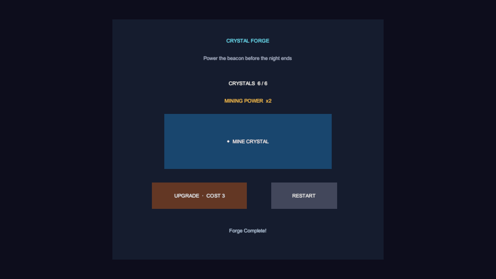

# Real-world game-creation benchmark — Crystal Forge

Date: 2026-08-03

Repository source: `df992f1`

CLI: `v0.1.0`

Connector: `0.0.76`, resolved from repository commit `df992f1`

Unity: `6000.3.5f2`

Fixture: `M17Fixture6000.3.5f2`, marked
`hera.mcp-benchmark-fixture/1` with `disposable=true`

## Why this benchmark exists

The earlier M15 benchmark repeated one read-only `scene info` task through five
transport surfaces. The M17 matrix exercised fourteen integration categories,
but it still ran them as separate scripted cases. Neither run measured the
experience of giving an AI one game-making goal and having it author code,
build a scene, repair integration failures, play the result, and verify what a
player sees.

This run closes that specific evidence gap. It is deliberately reported as a
real-world agent workflow, not as proof that MCP is more accurate or has the
same token cost as the CLI.

## User scenario

Build a small playable **Crystal Forge** game in a disposable Unity project:

1. The player mines one crystal per click.
2. Three crystals buy an upgrade and reset the stored crystals to zero.
3. The upgrade changes mining power from `x1` to `x2`.
4. Three upgraded clicks reach `6 / 6` and show `Forge Complete!`.
5. The mine button becomes disabled after winning.
6. Restart restores `0 / 6`, `x1`, and an enabled mine button.
7. The finished screen must contain visible text, not only correct hidden
   component state.

The agent had to author the runtime assembly and test assembly, compile in the
live Editor, build and save the UI scene, drive real Unity EventSystem input,
run the Unity Test Runner, capture the rendered overlay, and leave the Editor
ready with no console errors.

## Result

**Final result: PASS after repair. First-attempt result: FAIL.**

| Acceptance criterion | Evidence |
|---|---|
| Runtime and test code compile | Two requested Unity compiles completed; final error console contained zero entries. |
| Automated gameplay logic | EditMode test `PlayerCanMineUpgradeWinAndRestart` passed `1/1` after the final code change. |
| Input reaches the real button | `input inspect` reported the Mine button as the top raycast hit and its click handler as the target. |
| Base mining | Three EventSystem clicks produced `CRYSTALS  3 / 6` and `MINING POWER  x1`. |
| Upgrade | The Upgrade click produced `CRYSTALS  0 / 6`, `MINING POWER  x2`, and the doubled-power status message. |
| Win | Three more clicks produced `CRYSTALS  6 / 6`, `Forge Complete!`, and `m_Interactable=false`. |
| Restart | Restart produced `CRYSTALS  0 / 6`, `MINING POWER  x1`, and `m_Interactable=true`. |
| Visual output | The final 1280x720 capture visibly contains the title, score, power, button labels, and completion message. |
| Final Editor state | Play Mode exited; `CrystalForge.unity` was clean with two roots; error console matched zero entries. |

The generated fixture content remains under
`Assets/HeraRealWorldBenchmark/` in the disposable project for manual
inspection. Inventoria was never targeted or mutated.

## Timing and token-accounting boundary

The measured execution window ran from `19:07:45` to `19:23:37` KST: **15 minutes
52 seconds** from the first fixture mutation to the final clean Editor gate. The
earlier benchmark audit and scenario design are excluded.

This session did not expose provider-billed model-token telemetry, and the
measurement wrapper was not installed before every command. An exact total
token claim would therefore be fabricated. The retained measurements provide
only a lower bound:

| Measurement | Observed |
|---|---:|
| Instrumented phases | 25 |
| Instrumented Hera output | at least 35,571 UTF-8 bytes |
| Simple `ceil(bytes / 4)` estimate | at least 8,893 tool-result tokens |
| Complete model input/output tokens | not available |
| Provider billing tokens or cost | not available |

Two successful `ui_doc apply` responses were 5,620 and 5,378 bytes because
Game Feel UI Mode appended a long hint. Those two responses alone represent
roughly 2,750 tokens under the same byte-divided-by-four estimate. This is a
configuration-specific observation, not a universal MCP cost, but it proves
that the earlier 181-token seven-call smoke result must not be presented as the
cost of a real game-creation task.

## Repair history

The failures are part of the result, not discarded setup noise.

| # | Observation | Classification | Repair used |
|---:|---|---|---|
| 1 | Direct `exec` mutation returned `APPROVAL_REQUIRED`, but the legacy command has no `--approve` continuation. | Product usability gap | Reissued through typed `call exec`, performed preflight, then supplied its bound token and operation ID. |
| 2 | Typed `call ui_doc` rejected an object at `/doc`, although the action schema advertised object-or-string. | Strict-schema mismatch | Retried with a JSON string. |
| 3 | The JSON string passed strict validation but the Connector reported `apply needs 'doc'`. | Schema/dispatch mismatch | Used the established `ui_doc apply --file` path. |
| 4 | The fixture retained `ui_system=uitk`, so a uGUI document failed with `UI_SYSTEM_MISMATCH`. | Correct fail-closed environment detection | Explicitly selected uGUI. |
| 5 | Root-level `upsert` created a second Canvas rather than updating the first. | Surprising root-upsert behavior | Detected two IDs, deleted the older root through approved destruction, and retained one Canvas. |
| 6 | The generated Canvas had a GraphicRaycaster but no EventSystem, so physical game interaction failed with `INPUT_NO_EVENT_SYSTEM`. | Game-creation integration gap | Added an EventSystem and input module, then saved the scene. |
| 7 | `StandaloneInputModule` raised an Input API exception because the project uses the Input System package. | Input-backend mismatch | Replaced it with `InputSystemUIInputModule`. |
| 8 | `text.engine=auto` created TMP components without a renderable default font; state reads changed but the first capture contained no text. | User-visible correctness failure | Rebuilt the UI with `engine=legacy`; the next capture visibly rendered all required text. |
| 9 | One measurement step merged stdout JSON with the stderr Game Feel hint and failed to parse `root_id`. | Benchmark instrumentation error, not product execution | Re-read the unique root by name and attached the controller. |

## What this result does and does not prove

It proves that Hera can complete this bounded game-making workflow in a real
Unity Editor and that state-only validation would have produced a false PASS
before the visual repair. It also establishes a concrete regression scenario
for approval, strict tool calls, UI generation, input, tests, and capture.

It does **not** prove:

- an MCP-versus-CLI accuracy improvement;
- CLI/MCP token parity;
- a statistically meaningful first-attempt success rate;
- physical Windows mouse input, because the clicks were Unity EventSystem
  input rather than OS-level clicks;
- general game quality outside this small scenario.

The next comparative benchmark must run the same frozen user prompt in fresh
fixtures through the CLI-first and Compact MCP agent configurations, retain
complete model usage telemetry, and repeat each arm enough times to report a
distribution instead of one anecdote.

## Remediation status after the run

The original observations above remain unchanged as benchmark evidence. The
following source fixes were verified afterward in the same Unity `6000.3.5f2`
fixture:

1. Typed `call` now validates against the resolved action schema, so an object
   `doc` accepted by `ui_doc/apply` reaches the Connector unchanged.
2. Established CLI commands now return a continuable non-interactive preflight;
   repeating the identical command with `--approve <token>` completes it.
3. `text.engine=auto` uses TMP only with a renderable font and otherwise falls
   back to legacy Text with `LegacyRuntime.ttf`.
4. Root Canvas application creates or repairs an EventSystem with the input
   module selected by Unity's active input-handling compile defines and disables
   the incompatible built-in module in an exclusive input mode.
5. Root-level `upsert` reuses a same-named scene root instead of duplicating it.

Regression coverage includes strict typed-call validation, legacy menu approval
continuation, Unity compilation, four focused Editor tests, repeated root apply,
Play Mode EventSystem inspect/click, visible text capture, and zero console
errors. Connector source version is `0.0.77`; the benchmark itself still records
the released `0.0.76` package it originally exercised.

The long per-element Game Feel coaching remains unchanged. It is an intentional,
locked Game Feel UI Mode behavior rather than an accidental response field; a
future change requires an explicit product-design decision instead of silently
truncating it in this repair.
